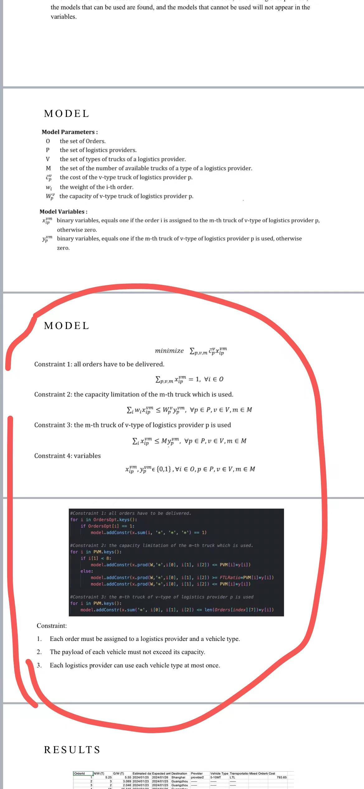
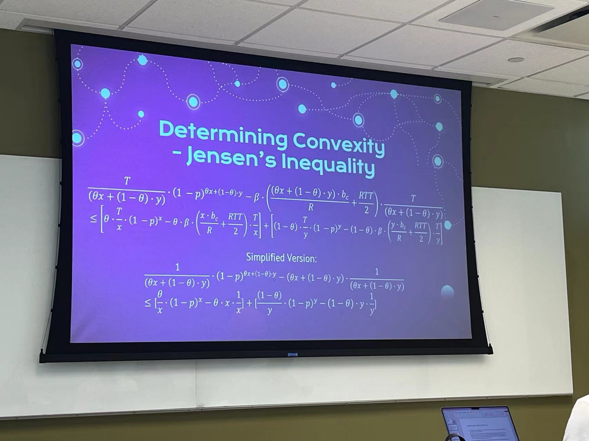
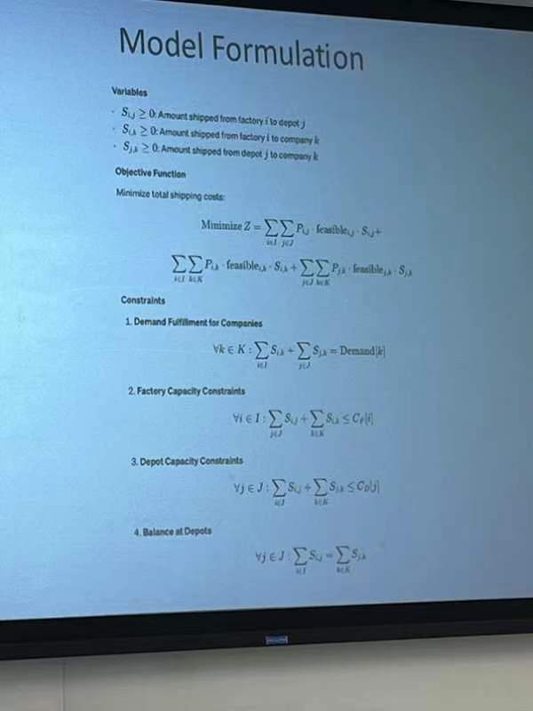

# 任务

差两个部分内容：

背景：全文已经写好了，差个实验结果。

全文内容：(2) Related Work (2) 相关工作; (4)Experiment/Simulation Results. (4) 实验/模拟结果

分析：

1. 差实验结果等于重新做实验;

时间节点：4天要，4天交稿。

## 所需补充内容

报告：您必须提交一份最终项目报告（采用 IEEE 模板，请从此处下载 <https://www.ieee.org/conferences/publishing/templates.html>。项目报告必须至少包含以下重要部分：(1) 引言 (2) 相关工作 (2) 问题提出 (3) 方法 (4) 实验/模拟结果。

## 语言要求

英文版

## 参考资料

ChuxuanTang_Final.pptx : 本人的最终项目报告

要求：网上扒拉搞的ppt,至少最后论文得有这ppt数据、模型、结果些东西,做参考

## 方法论

- 方法论里有我能加入模型和公式吗？
- 其他同学都有 在方法论里加入

这部分方法论：

方法论的例子

## 第一版报告存在的问题

1. 报告做完老师说有点偏题
2. 没有用到convex optimization的课程内容
3. 多加点convex optimization method的内容 就是要给出公示

## PPT案例

ECE_720_Presentation_Shubo.pdf ：电子与计算机工程(Electrical and Computer Engineering)课程演示文稿。

## 分析解决方案

1. 用最优化实现：最优化直接套算法
2. 老师想：根据公式编写代码，然后跑一下结果
